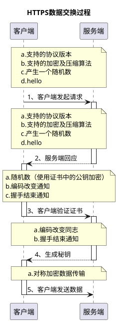

```plantuml
@startuml
title HTTPS数据交换过程

note over 客户端, 服务端
a.支持的协议版本
b.支持的加密及压缩算法
c.产生一个随机数
d.hello
end note
客户端 -> 服务端:  1、客户端发起请求        


activate 服务端
note over 客户端, 服务端
a.支持的协议版本
b.支持的加密及压缩算法
c.产生一个随机数
d.hello
end note
服务端 --> 客户端:2、服务端回应
deactivate 服务端


activate 客户端
note over 服务端, 客户端
a.随机数（使用证书中的公钥加密）
b.编码改变通知
c.握手结束通知
end note
客户端 -> 服务端:3、客户端验证证书
deactivate 客户端


activate 服务端
note over 服务端, 客户端
a.编码改变同志
b.握手结束通知
end note
服务端 --> 客户端:4、生成秘钥
deactivate 服务端


activate 客户端
note over 服务端, 客户端
a.对称加密数据传输
end note
客户端 -> 服务端:5、客户端发送数据
deactivate 客户端
@enduml
```